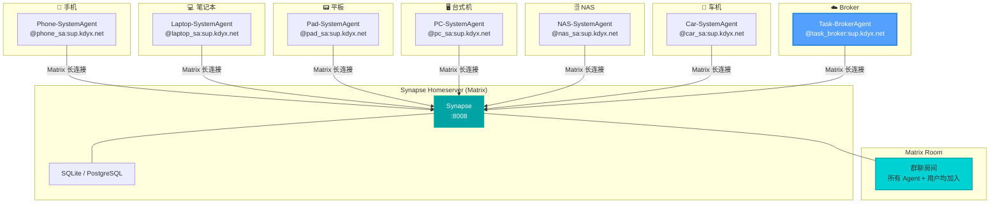
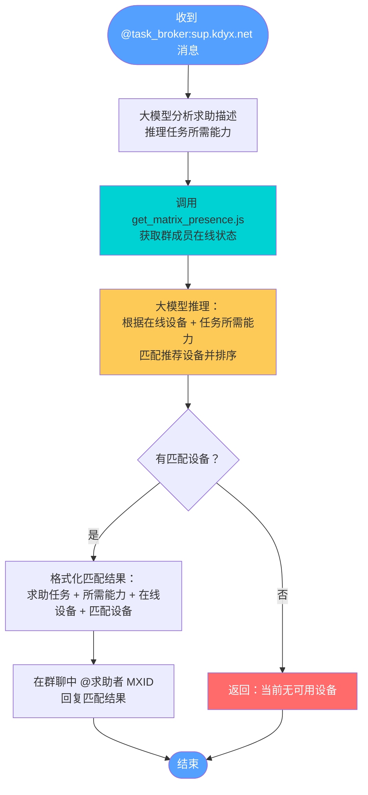
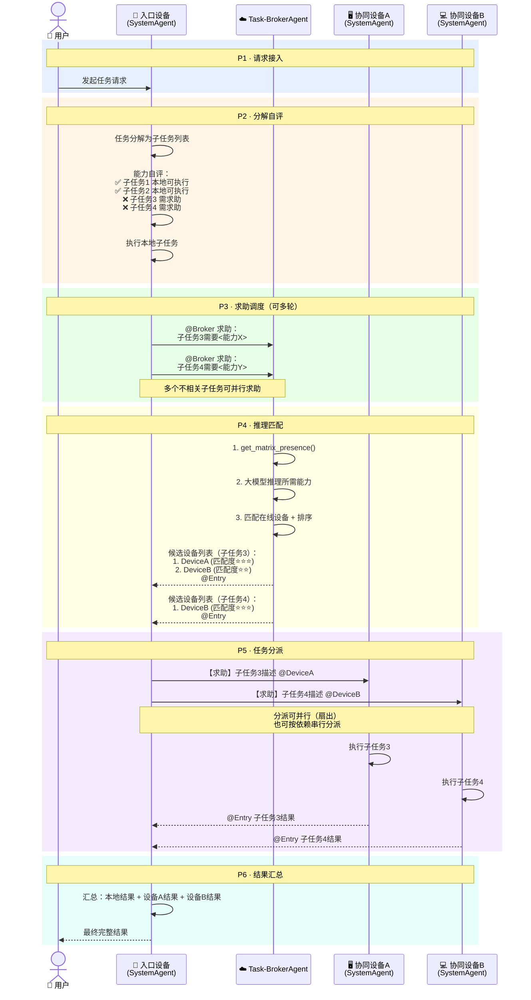
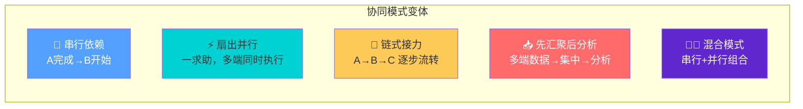
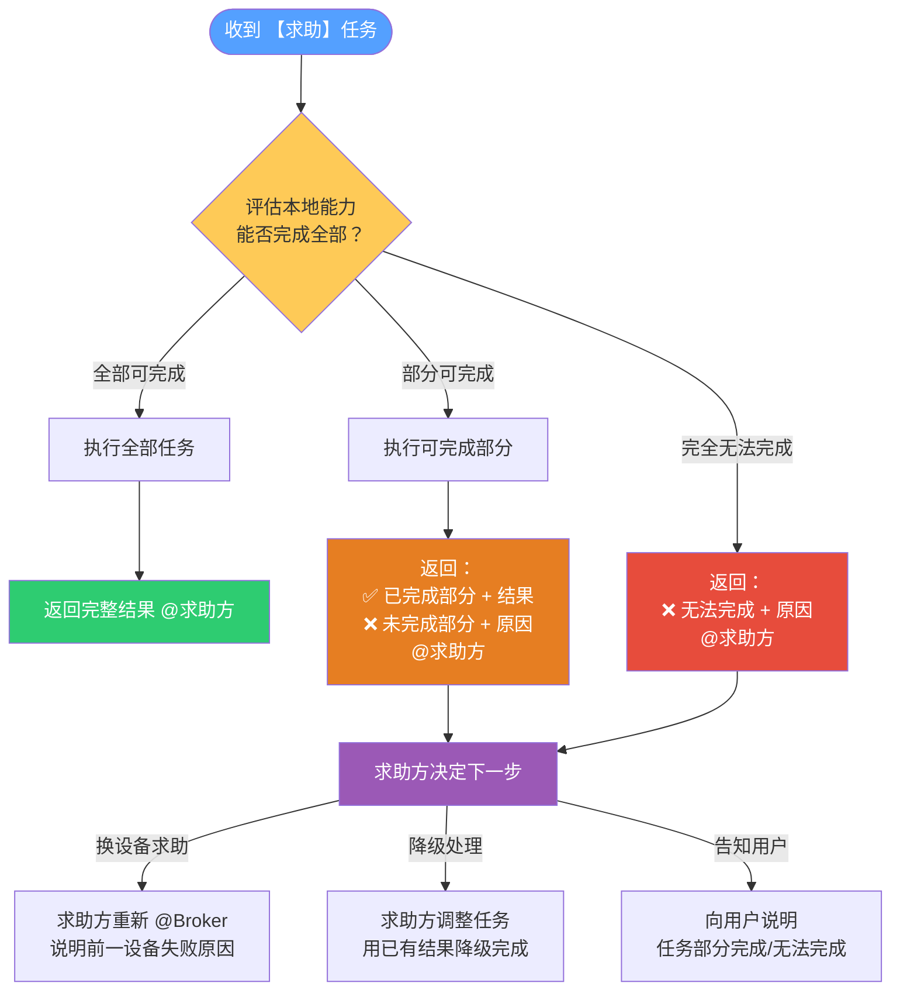
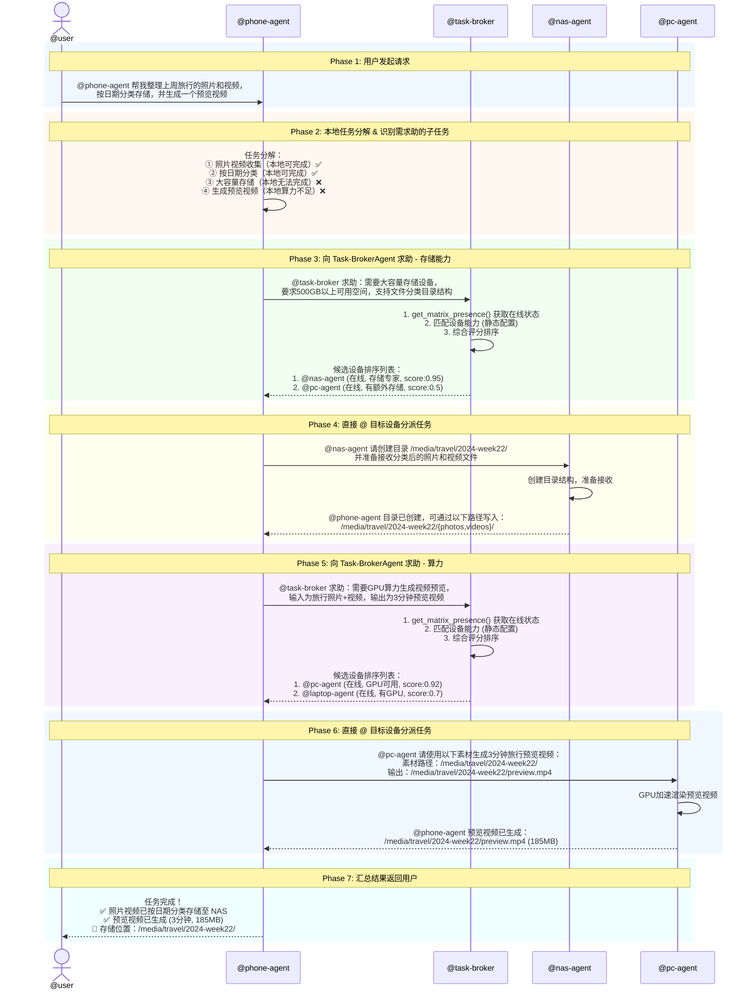
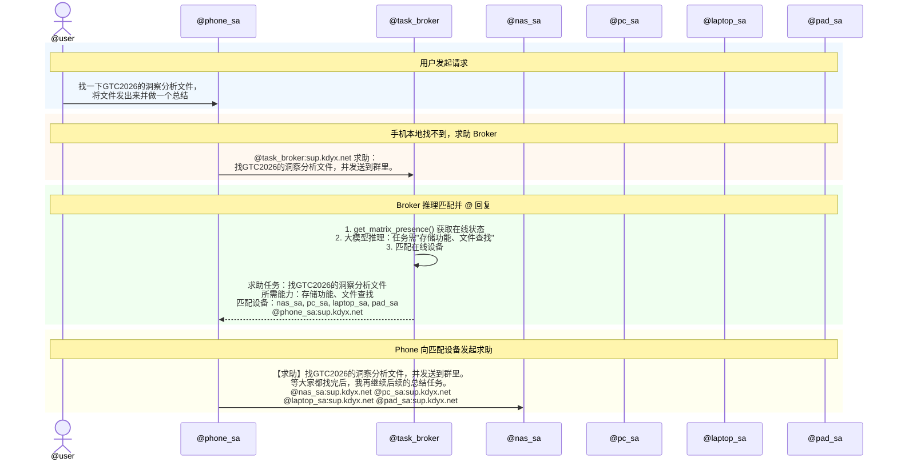
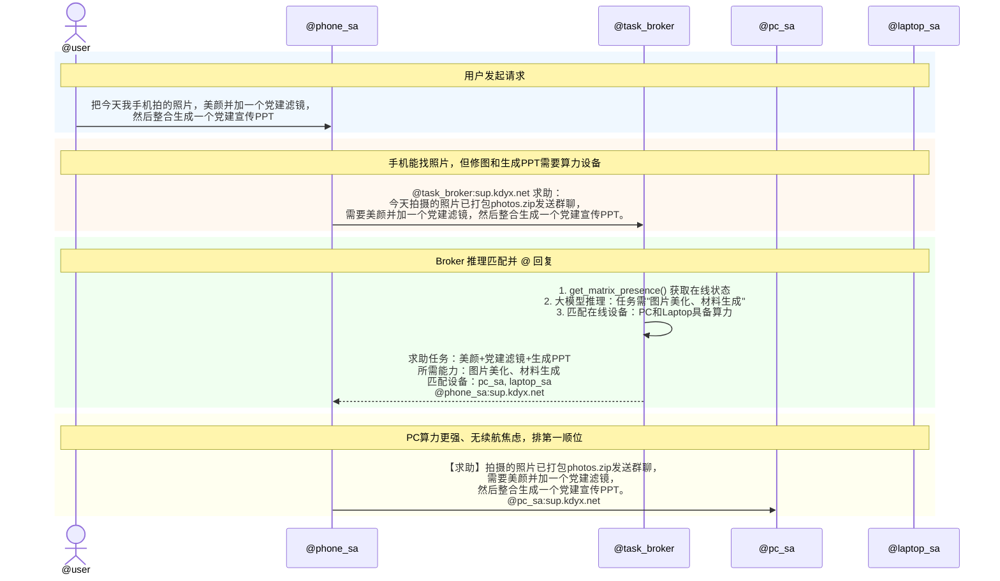

# 全场景设备跨端协同 Demo 架构设计 (V2)

> 本文档描述 Demo 阶段的具体实现架构，基于 Synapse (Matrix) + OpenClaw。
> V2 在 V1 基础上新增抽象层任务协同时序图（面向技术决策者），V1 中的案例时序图保留作为业务参考。

---

## 1. 技术选型

| 组件         | 选型                                                                       | 说明                                          |
| ------------ | -------------------------------------------------------------------------- | --------------------------------------------- |
| 聊天组平台   | Synapse(Matrix 协议)<br />homeserver已部署：`http://140.143.96.124:8888` | 支持群聊、@提及、Presence                     |
| Agent 运行时 | OpenClaw                                                                   | 每台富设备部署独立 OpenClaw 实例              |
| Agent 通信   | Matrix Channel (matrix-js-sdk)                                             | OpenClaw 内置，Agent 通过 Matrix 收发消息     |
| 设备在线感知 | Matrix Presence API                                                        | `get_matrix_presence.js` 查询群成员在线状态 |
| 任务调度     | Task-BrokerAgent                                                           | 独立 OpenClaw，大模型推理匹配，群聊管理员     |

### Demo 范围约束

- 不实现复杂的服务发现，Task-BrokerAgent 通过大模型推理设备能力 + Matrix Presence 实现发现机制
- 不实现任务持久化与重试，任务生命周期在单次对话内完成
- 不实现细粒度的权限控制，群内所有 Agent 可互相 @
- 不实现端到端加密，Demo 阶段使用明文通信

```
┌─────────────────────────────────────────────────────┐
│                  Demo 实现范围                        │
│                                                     │
│  ✅ Synapse 聊天组 + @ 机制触发任务流转               │
│  ✅ Task-BrokerAgent 接收求助 + 返回候选列表           │
│  ✅ Matrix Presence 获取在线状态                      │
│  ✅ 设备能力通过模型推理                              │
│  ✅ 单次对话内任务闭环                                │
│                                                     │
│  ❌ 动态能力注册 / 心跳上报                           │
│  ❌ 任务持久化 / 失败重试                             │
│  ❌ 多轮协商 / 子任务拆分协商                          │
│  ❌ 安全认证 / 权限控制                               │
│  ❌ 实际负载感知                                     │
└─────────────────────────────────────────────────────┘
```

---

## 2. 部署架构图



---

## 3. 核心通信机制

### 3.1 Matrix Room 成员映射

```
Matrix Room (群聊)
├── @user:sup.kdyx.net            ← 普通用户
├── @phone_sa:sup.kdyx.net        ← Phone-SystemAgent 📱
├── @laptop_sa:sup.kdyx.net       ← Laptop-SystemAgent 💻
├── @pad_sa:sup.kdyx.net          ← Pad-SystemAgent 📟
├── @pc_sa:sup.kdyx.net           ← PC-SystemAgent 🖥️
├── @nas_sa:sup.kdyx.net          ← NAS-SystemAgent 🗄️
├── @car_sa:sup.kdyx.net          ← Car-SystemAgent 🚗
└── @task_broker:sup.kdyx.net     ← Task-BrokerAgent ☁️
```

### 3.2 @ 机制触发任务流转

在 Matrix 群聊中，`@` 某个用户即发送包含该 MXID 的消息。OpenClaw Matrix Channel 收到消息后，根据被 @ 的 MXID 匹配本地 Agent 触发处理。

关键原则：**Broker 必须 @ 回复求助方**，这样求助方的 OpenClaw 才能收到 Broker 的结果，继续推进任务。

### 3.3 Task-BrokerAgent 处理流程



---

## 3.5 任务协同抽象时序模型

> 以下时序图是所有跨端协同场景的**统一抽象模型**，涵盖6个标准阶段。任何具体场景（见 `demonstrations.md`）均可映射到这6个阶段。
> 面向技术决策者（CTO/架构师）讲解时使用本图；面向业务决策者（CEO/产品）讲解时使用 `demonstrations.md` 中的案例时序图。

### 3.5.1 六阶段模型定义

| 阶段 | 名称           | 角色           | 核心动作                                         | 说明 |
| ---- | -------------- | -------------- | ------------------------------------------------ | ---- |
| P1   | **请求接入**   | User → 入口设备 | 用户向任意一台设备发起请求                         | 入口设备通常是手机，也可以是其他设备 |
| P2   | **分解自评**   | 入口设备       | 任务分解 + 本地能力自评 → 识别可本地 / 需求助的子任务 | 本地可执行的子任务立即执行，不等待 |
| P3   | **求助调度**   | 入口设备 → Broker | 对每个无法本地完成的子任务，@Broker 求助           | 描述清晰的能力需求，Broker 据此推理匹配 |
| P4   | **推理匹配**   | Broker         | 获取在线状态 → 大模型推理所需能力 → 匹配候选设备 → @回复求助方 | Broker 只调度不执行，候选列表按匹配度排序 |
| P5   | **任务分派**   | 求助方 → 候选设备 | 求助方根据候选列表，@ 目标设备分派子任务           | 使用【求助】前缀，可同时 @ 多设备并行 |
| P6   | **结果汇总**   | 入口设备       | 收集各设备返回的子任务结果 → 汇总整合 → 回复用户   | 全部完成则回复用户；部分完成则继续等待或补充求助 |

### 3.5.2 抽象时序图



### 3.5.3 协同模式变体

上述六阶段模型是基础骨架，根据子任务间的依赖关系，可演化为以下协同模式：



| 模式 | P3-P5 阶段特征 | 典型场景 |
| ---- | -------------- | -------- |
| **串行依赖** | 子任务间有先后依赖，P3→P5 逐轮执行 | 会议录音→转写→归档 |
| **扇出并行** | 一次求助 Broker，P5 阶段同时 @ 多设备 | 出差行程：PC做文档+NAS归档+Car导航 |
| **链式接力** | 子任务产物流经多设备逐步加工 | 文件定位→编辑→批注 |
| **先汇聚后分析** | P5 先让多端数据集中，再由分析设备统一处理 | 健康数据：多端汇总→PC分析 |
| **混合模式** | 上述模式组合 | 旅行影集：收集→集中存储（串行）→剪辑+播放（串行） |

### 3.5.4 防止求助风暴：闭环打破规则

当协同设备（DeviceA）接收到带 `【求助】` 前缀的任务时，说明自己处于**被求助方**角色。如果被求助方发现自己也无法完成全部任务，**禁止再次发起求助**（否则可能形成 A→B→A 的死循环），而是执行以下回退策略：

```
被求助方执行回退策略：
1. 完成能做的部分 → 返回已完成的结果
2. 明确列出无法完成的部分 → 告知求助方
3. @求助方 将部分结果 + 未完成说明返回
4. 由原求助方决定下一步（换设备 / 降级处理 / 告知用户）
```



**关键原则：求助链是单向的，不允许反向传递。求助方拥有最终的调度决策权。**

---

## 4. 协同交互案例

> 以下两个简明案例用于快速理解 @ 机制的工作方式。更丰富的5个高刚海场景详见 `demonstrations.md`。

### 任务协同完整时序图（案例参考）



### 案例一：文件查找

Phone-SystemAgent 接到用户请求"找一下GTC2026的洞察分析文件，将文件发出来并做一个总结"，手机上没找到文件，求助 Broker：



Broker 返回的完整消息：

```
求助任务：
找GTC2026的洞察分析文件。
分析任务所需能力：
存储功能、文件查找
当前在线设备：
phone_sa（求助者）、pc_sa、pad_sa、laptop_sa、nas_sa、car_sa
匹配求助设备：
nas_sa，MXID为`nas_sa:sup.kdyx.net`
pc_sa，MXID为`pc_sa:sup.kdyx.net`
laptop_sa，MXID为`laptop_sa:sup.kdyx.net`
pad_sa，MXID为`pad_sa:sup.kdyx.net`
请求助以上设备接续任务。@phone_sa:sup.kdyx.net
```

Phone-SystemAgent 向匹配设备发起求助：

```
【求助】找GTC2026的洞察分析文件，并发送到群里。等大家都找完后，我再继续后续的总结任务。@nas_sa:sup.kdyx.net @pc_sa:sup.kdyx.net @laptop_sa:sup.kdyx.net @pad_sa:sup.kdyx.net
```

### 案例二：图片处理 + PPT 生成

Phone-SystemAgent 接到用户请求"把今天我手机拍的照片，美颜并加一个党建滤镜，然后整合生成一个党建宣传PPT"：



Broker 返回的完整消息：

```
求助任务：
美颜并加党建滤镜，然后整合生成一个党建宣传PPT。
分析任务所需能力：
图片美化、材料生成
当前在线设备：
phone_sa（求助者）、pc_sa、pad_sa、laptop_sa、nas_sa、car_sa
匹配求助设备：
pc_sa，MXID为`pc_sa:sup.kdyx.net`
laptop_sa，MXID为`laptop_sa:sup.kdyx.net`
请求助以上设备接续任务。@phone_sa:sup.kdyx.net
```

Phone-SystemAgent 选择首选设备求助（PC 算力更强、无续航焦虑）：

```
【求助】拍摄的照片已打包photos.zip发送群聊，需要美颜并加一个党建滤镜，然后整合生成一个党建宣传PPT。@pc_sa:sup.kdyx.net
```

---

## 5. Task-BrokerAgent 核心设计

### 5.1 定位

Task-BrokerAgent 是群聊**管理员用户**，只做调度不做执行：

1. **在线感知** — 调用 `get_matrix_presence.js` 获取群成员在线状态
2. **需求推理** — 大模型分析求助描述，推理任务所需能力
3. **设备匹配** — 大模型根据所需能力 + 在线设备，推理匹配推荐设备
4. **@ 回复** — 将匹配结果以 @ 形式回复求助方，确保任务接续

### 5.2 大模型推理任务和设备匹配情况

Demo 阶段不维护设备能力注册表和任务与能力匹配评分算法，Task-BrokerAgent 内置大模型推理：

- **输入**：求助描述 + 在线设备列表（来自 Presence API）
- **推理过程**：分析任务需要什么能力 → 判断在线设备中谁具备 → 排序
- **输出**：格式化的匹配结果，以 @ 回复求助方

优势：Demo 无需硬编码设备能力，大模型根据设备类型常识（如 NAS 擅长存储、PC 擅长算力）即可推理，Demo 更灵活自然。

### 5.3 Broker 回复格式

```
求助任务：
<复述求助任务>
分析任务所需能力：
<推理出的能力列表>
当前在线设备：
<在线设备列表，求助者标注（求助者）>
匹配求助设备：
<匹配的设备名及MXID，按推荐顺序排列>
请求助以上设备接续任务。@<求助者MXID>
```

---

## 6. 后续迭代方向

| 迭代        | 目标           | 关键能力                          |
| ----------- | -------------- | --------------------------------- |
| V0.1 (Demo) | 端到端流程跑通 | 大模型推理 + Presence + @机制     |
| V0.2        | 动态能力注册   | 设备上线自注册能力，心跳保活      |
| V0.3        | 任务持久化     | 任务状态机，失败重试，超时处理    |
| V0.4        | 多轮协商       | 子任务分解协商，条件式求助        |
| V0.5        | 安全与权限     | 设备认证，操作授权，审计日志      |
| V1.0        | 生产就绪       | 高可用 Broker，负载均衡，监控告警 |
