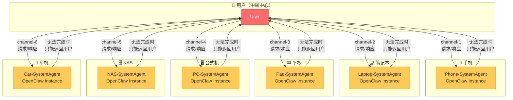
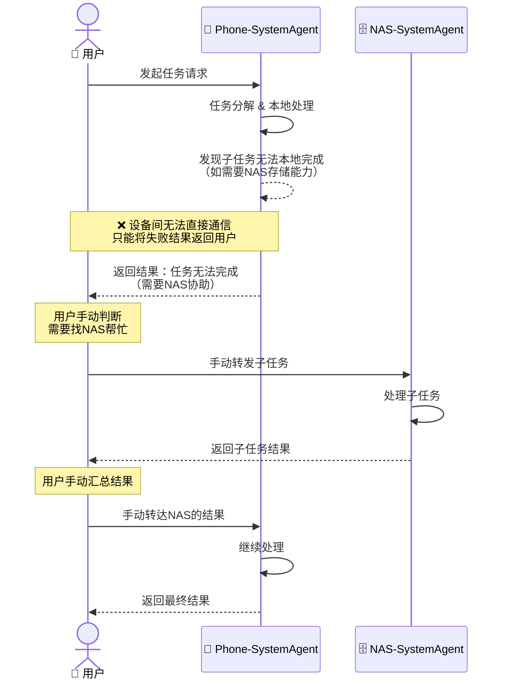
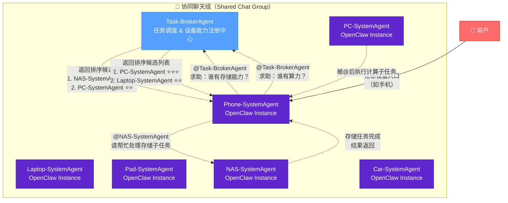
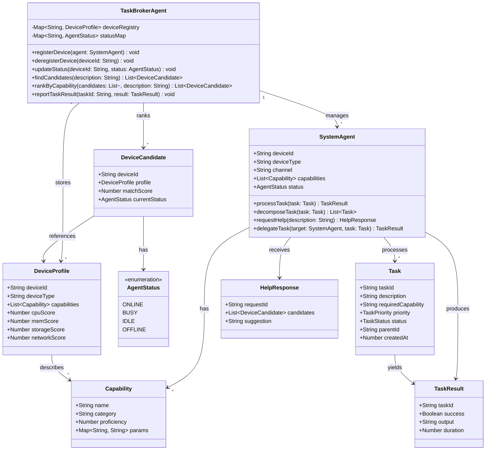
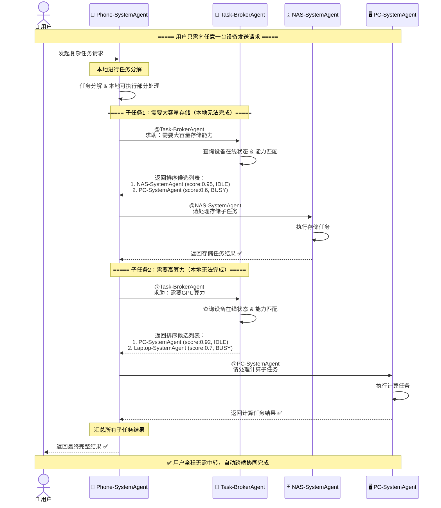
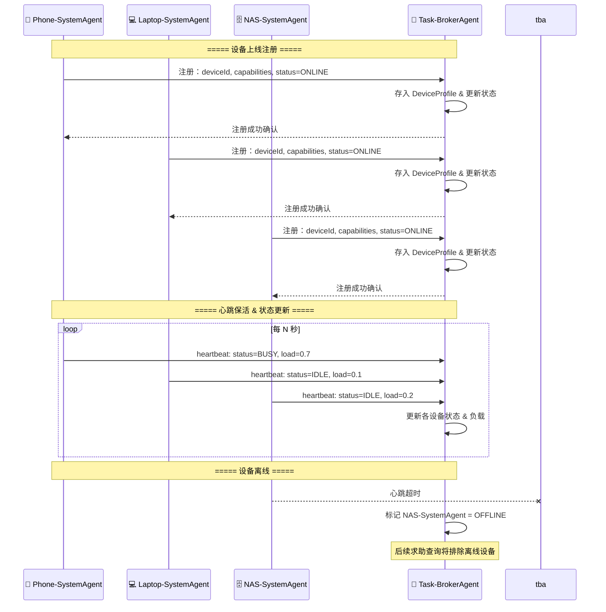
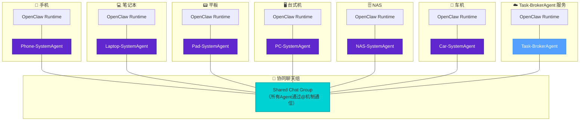

# 全场景设备跨端协同架构设计

## 1. 当前实现：用户中转模式（Star Topology）

> 用户作为中转中心，分别和不同设备的 OpenClaw 连接。设备间无法直接通信，任务无法跨端时只能返回用户，由用户手动中转。

### 1.1 组件图（Component Diagram）

### 1.2 当前模式时序图（Sequence Diagram）

### 1.3 当前模式问题分析

| 问题 | 描述 |
|------|------|
| **单点瓶颈** | 用户是唯一的中转节点，所有跨设备任务必须经过用户 |
| **手动中转** | 设备间无法直接通信，用户需要理解任务依赖并手动分配 |
| **体验割裂** | 一次请求可能需要多轮用户交互才能完成 |
| **能力孤岛** | 每台设备的能力被隔离，无法自动发现和组合 |
| **延迟高** | 用户介入的等待时间 + 理解判断时间 = 不可控延迟 |

---

## 2. 新实现：Task-BrokerAgent 协同模式

> 所有富设备的 SystemAgent 与 Task-BrokerAgent 处于同一聊天组中，通过 @ 机制实现任务流转。设备搞不定时主动求助 Task-BrokerAgent，获取候选设备列表后直接 @ 目标设备协同。

### 2.1 组件图（Component Diagram）

### 2.2 核心架构类图（Class Diagram）

### 2.3 协同时序图（Sequence Diagram）

### 2.4 设备注册与心跳时序图

### 2.5 部署图（Deployment Diagram）

---

## 3. 两种模式对比

### 3.1 拓扑对比

| 维度 | 当前模式（用户中转） | 新模式（Task-BrokerAgent协同） |
|------|---------------------|-------------------------------|
| **拓扑结构** | 星型（User为中心） | 网状（Chat Group + Broker） |
| **通信方式** | 用户 ↔ 单设备 | 设备 ↔ 设备（@机制） |
| **跨端协同** | ❌ 不支持 | ✅ 自动求助 & 任务分派 |
| **能力发现** | ❌ 无（用户靠记忆） | ✅ Task-BrokerAgent 维护能力注册表 |
| **负载感知** | ❌ 无 | ✅ 心心跳 + 状态上报 |
| **候选排序** | ❌ 无 | ✅ 综合评分排序 |
| **用户介入** | 每次跨端必须介入 | 仅发起请求，全程自动 |
| **容错** | 依赖用户判断 | Broker自动排除离线设备 |

### 3.2 关键设计决策

1. **聊天组 + @机制**：所有 SystemAgent 和 Task-BrokerAgent 在同一聊天组，通过 @ 触发任务流转，与 OpenClaw 的 channel 机制天然契合
2. **Broker 不执行任务**：Task-BrokerAgent 仅做调度，不承担具体任务执行，避免单点性能瓶颈
3. **求助不中断**：设备发现自己搞不定时，不返回用户，而是先向 Broker 求助，实现"静默协同"
4. **候选排序**：Broker 返回的候选列表按综合评分排序，求助方按序选择，提高匹配效率
5. **心跳保活**：定期心跳确保设备在线状态准确，离线设备自动排除
