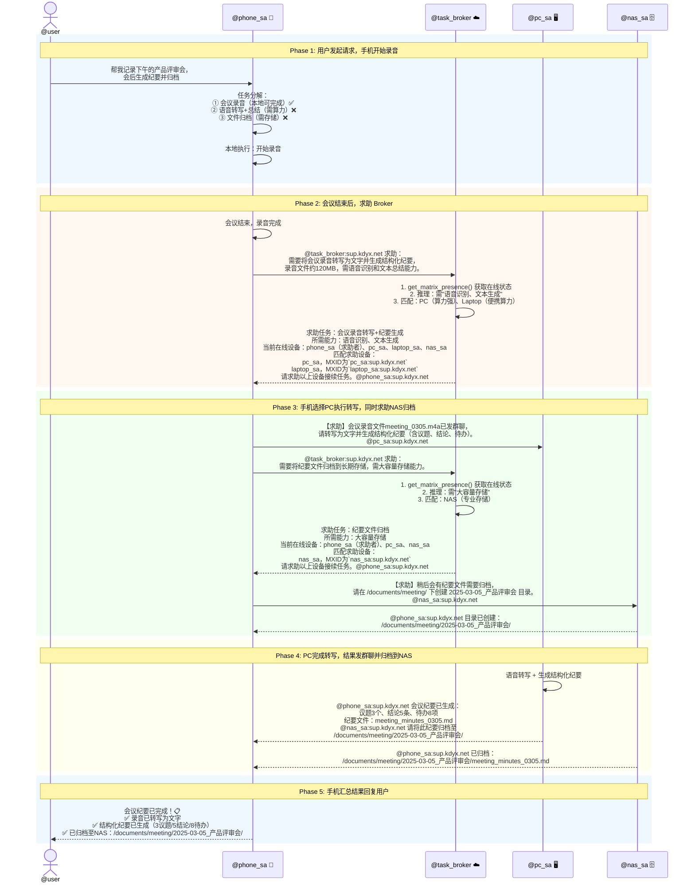
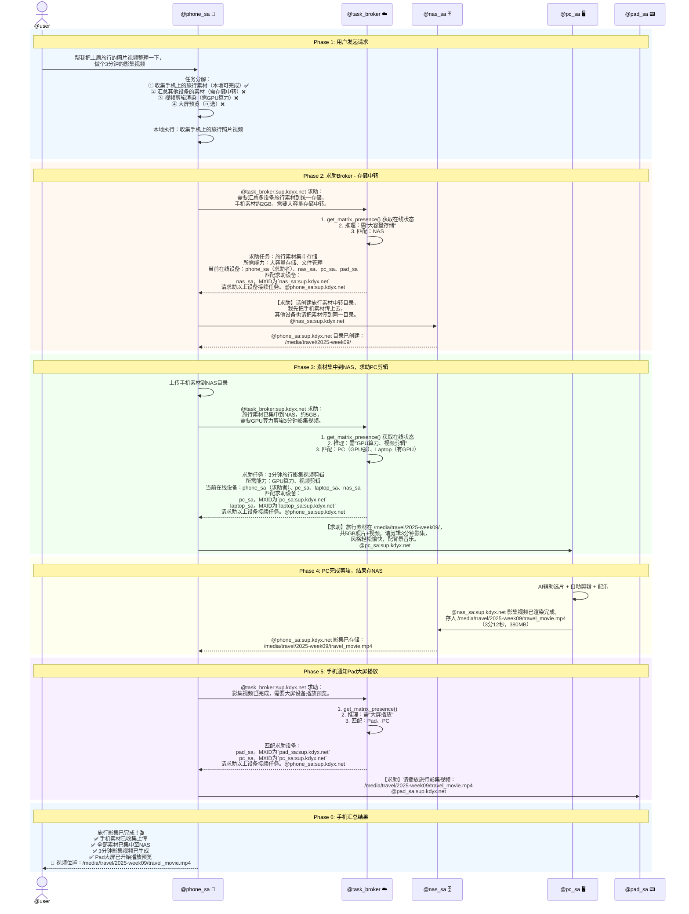
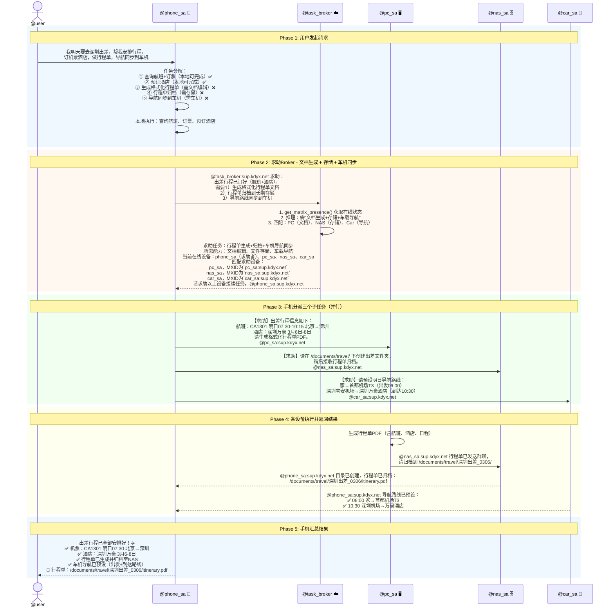
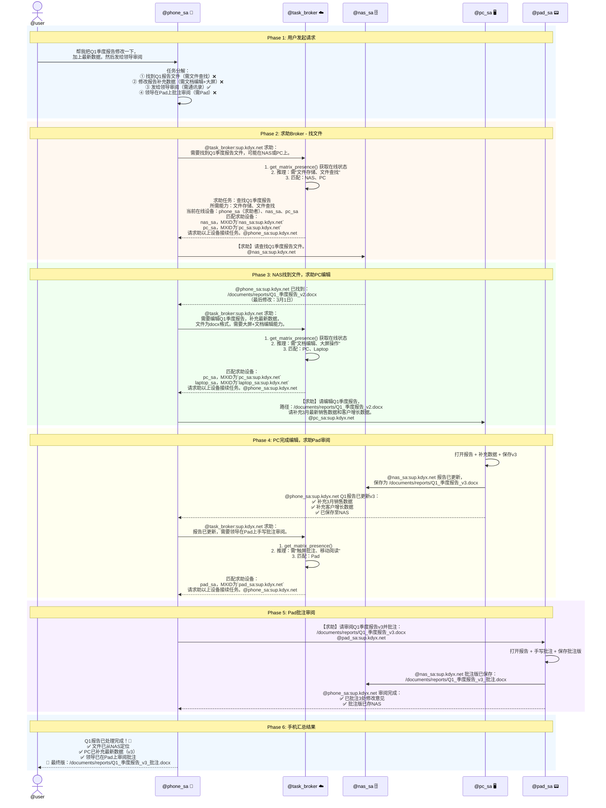
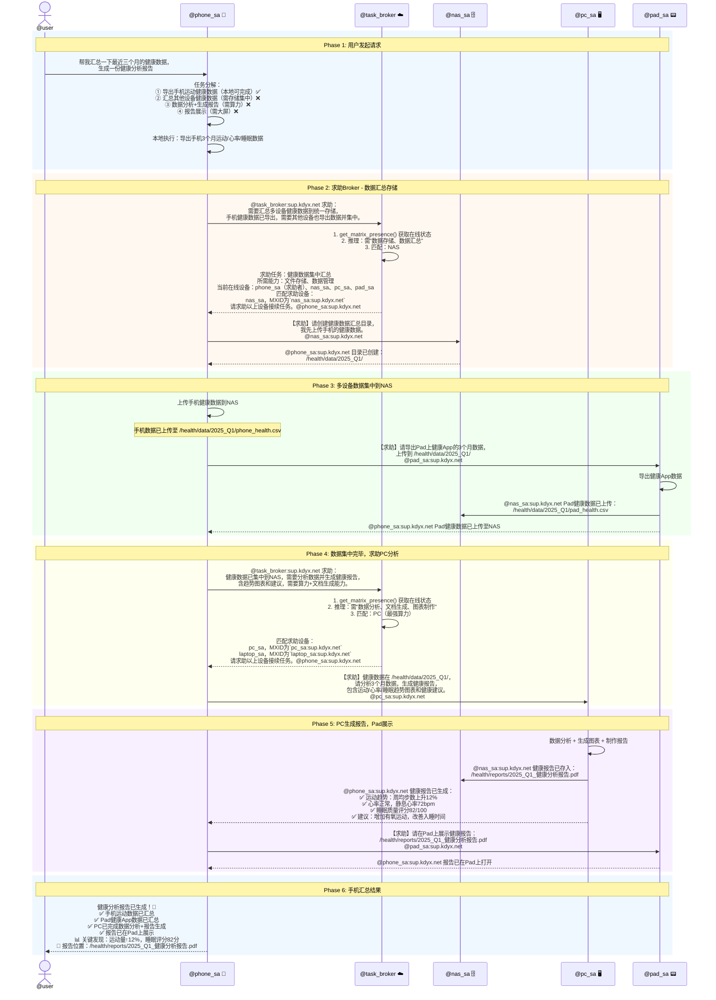

# 全场景跨端协同 — 高刚海场景演示

> 以下5个场景均为高频、刚需、海量用户覆盖的典型用例，覆盖不同设备组合与协同模式，充分体现跨端协同的价值。

---

## 场景一：智能会议纪要生成

> **用户痛点：** 开会时手动记录效率低，会后整理纪要耗时，纪要归档到哪台设备总找不到。
> **协同价值：** 手机录音 → PC转写总结 → NAS归档，全程自动，用户无需操心。

**用户请求：** "帮我记录下午的产品评审会，会后生成纪要并归档"

### 时序图

### 协同模式分析

| 维度     | 说明                               |
| -------- | ---------------------------------- |
| 触发设备 | Phone（用户入口 + 录音）           |
| 协同设备 | PC（转写+总结）、NAS（归档）       |
| 协同模式 | 串行+并行：录音→转写→归档，NAS建目录与PC转写并行 |
| 关键价值 | 用户只说一句话，录音-转写-归档全链路自动完成 |

---

## 场景二：家庭旅行影集制作

> **用户痛点：** 旅行拍了大量照片视频散落各设备，整理费力，做影集视频更是技术活。
> **协同价值：** 手机收集素材 → NAS集中存储 → PC自动剪辑 → Pad大屏欣赏，各司其职。

**用户请求：** "帮我把上周旅行的照片视频整理一下，做个3分钟的影集视频"

### 时序图

### 协同模式分析

| 维度     | 说明                                     |
| -------- | ---------------------------------------- |
| 触发设备 | Phone（用户入口 + 素材收集）             |
| 协同设备 | NAS（存储中转）、PC（视频剪辑）、Pad（大屏播放） |
| 协同模式 | 管线式：收集→集中存储→剪辑→播放，前后依赖 |
| 关键价值 | 四端协同，各取所长，从散落素材到成品影集一步到位 |

---

## 场景三：出差行程全流程管理

> **用户痛点：** 出差前要订票订酒店、做行程单，上了车又要重新设导航，文件散落各处。
> **协同价值：** 手机订票 → PC生成行程单 → NAS存档 → Car同步导航，跨端接力无缝衔接。

**用户请求：** "我明天要去深圳出差，帮我安排行程，订机票酒店，做行程单，导航同步到车机"

### 时序图

### 协同模式分析

| 维度     | 说明                                       |
| -------- | ------------------------------------------ |
| 触发设备 | Phone（用户入口 + 订票订酒店）             |
| 协同设备 | PC（行程单）、NAS（归档）、Car（导航同步） |
| 协同模式 | 扇出并行：一个求助，三端同时执行            |
| 关键价值 | 一次请求搞定订票+文档+归档+车机，零手工中转 |

---

## 场景四：跨端文件协作编辑

> **用户痛点：** 在手机上发现一个文件需要修改，但手机编辑体验差；改完后要发给别人审阅，对方用Pad批注。
> **协同价值：** 手机发起 → NAS定位文件 → PC编辑 → Pad批注，跨端接力完成文件全生命周期。

**用户请求：** "帮我把Q1季度报告修改一下，加上最新数据，然后发给领导审阅"

### 时序图

### 协同模式分析

| 维度     | 说明                                     |
| -------- | ---------------------------------------- |
| 触发设备 | Phone（用户入口 + 通讯录）               |
| 协同设备 | NAS（定位+存储）、PC（编辑）、Pad（批注）|
| 协同模式 | 链式接力：定位→编辑→审阅，每一步依赖上一步 |
| 关键价值 | 文件全生命周期跨端流转，每一步由最合适的设备完成 |

---

## 场景五：家庭健康数据汇总与报告

> **用户痛点：** 各设备上的健康数据分散（手机运动、Pad健康App、PC体检报告），从没整合分析过。
> **协同价值：** 手机采集日常数据 → NAS汇总历史 → PC分析生成报告 → Pad展示，把散落数据变成可用的健康洞察。

**用户请求：** "帮我汇总一下最近三个月的健康数据，生成一份健康分析报告"

### 时序图

### 协同模式分析

| 维度     | 说明                                             |
| -------- | ------------------------------------------------ |
| 触发设备 | Phone（用户入口 + 运动数据采集）                 |
| 协同设备 | NAS（数据汇总存储）、Pad（数据源+展示）、PC（分析）|
| 协同模式 | 先汇聚后分析：多端数据先集中到NAS，再由PC统一分析 |
| 关键价值 | 打通各设备数据孤岛，让分散的健康数据变成可操作洞察 |

---

## 五场景协同模式总结

| 场景 | 协同设备 | 协同模式 | 核心价值 |
| ---- | -------- | -------- | -------- |
| 智能会议纪要 | Phone→PC→NAS | 串行+并行 | 录音→转写→归档全链路自动 |
| 家庭旅行影集 | Phone→NAS→PC→Pad | 管线式 | 四端各司其职，素材到成品一步到位 |
| 出差行程管理 | Phone→PC+NAS+Car | 扇出并行 | 一次求助三端并行执行 |
| 跨端文件协作 | Phone→NAS→PC→Pad | 链式接力 | 文件全生命周期跨端流转 |
| 健康数据报告 | Phone+Pad→NAS→PC→Pad | 先汇聚后分析 | 打通数据孤岛，变数据为洞察 |
